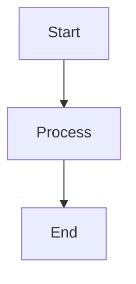

# Enhanced MarkdownMaker

A comprehensive PowerPoint to Markdown conversion system built on Microsoft's MarkItDown library, featuring enhanced object counting, intelligent image processing, and automatic Mermaid diagram generation.

## Features

### Core Capabilities
- **Smart PowerPoint Conversion**: Convert .pptx files to clean, structured Markdown
- **Object Count Detection**: Automatically count visual objects in each slide
- **Intelligent Image Processing**: Save complex slides (5+ objects) as high-quality images
- **Mermaid Diagram Generation**: Convert complex visuals to Mermaid diagram syntax
- **LLM Integration**: Optional OpenAI integration for advanced slide analysis
- **Batch Processing**: Convert multiple presentations efficiently
- **Flexible Configuration**: YAML, JSON, and environment variable support

### Key Differentiators
- Built on proven MarkItDown library foundation
- Minimal custom code with maximum functionality
- Production-ready with comprehensive error handling
- Extensible plugin architecture
- Clean separation of concerns

## Installation

### Basic Installation

```bash
# Clone the repository
git clone https://github.com/yourusername/enhanced-markdown-maker.git
cd enhanced-markdown-maker

# Install dependencies
pip install -r requirements.txt

# Or install via setup.py
pip install -e .
```

### Installation with Optional Features

```bash
# With LLM support
pip install -e ".[llm]"

# With development tools
pip install -e ".[dev]"

# With UI enhancements
pip install -e ".[ui]"

# Install everything
pip install -e ".[all]"
```

### System Requirements

- Python 3.8 or higher
- Optional: LibreOffice (for slide image extraction)
- Optional: OpenAI API key (for LLM features)

## Quick Start

### Command Line Usage

```bash
# Convert a single PowerPoint file
markdown-maker convert presentation.pptx

# Convert with custom output directory
markdown-maker convert presentation.pptx -o output/docs

# Convert with lower object threshold
markdown-maker convert presentation.pptx -t 3

# Enable Mermaid diagram generation
markdown-maker convert presentation.pptx -m

# Batch convert all files in a directory
markdown-maker batch presentations/ -o output/

# Analyze a presentation without converting
markdown-maker analyze presentation.pptx -v

# Generate Mermaid diagram
markdown-maker mermaid presentation.pptx -t flowchart -o diagram.mmd
```

### Python API Usage

```python
from enhanced_markdown_maker import EnhancedMarkdownMaker

# Basic conversion
maker = EnhancedMarkdownMaker(
    llm_client=None,
    output_dir="output",
    object_threshold=5
)

markdown, metadata = maker.convert_powerpoint("presentation.pptx")

print(f"Converted {metadata.total_slides} slides")
print(f"Saved {metadata.slides_as_images} complex slides as images")
```

### With LLM Integration

```python
from openai import OpenAI
from enhanced_markdown_maker import EnhancedMarkdownMaker

# Initialize OpenAI client
client = OpenAI(api_key="your-api-key")

# Create converter with LLM support
maker = EnhancedMarkdownMaker(
    llm_client=client,
    llm_model="gpt-4o",
    output_dir="output",
    enable_mermaid=True
)

# Convert with AI-powered analysis
markdown, metadata = maker.convert_powerpoint("presentation.pptx")
```

## Configuration

### Configuration File

Create `markdown_maker.yaml`:

```yaml
conversion:
  object_threshold: 5
  output_dir: "output"
  enable_mermaid: true
  save_metadata: true
  create_toc: true
  watermark_images: false

image:
  width: 1920
  height: 1080
  dpi: 300
  quality: 95

mermaid:
  enabled: true
  enable_styling: true
  max_nodes: 10
  auto_detect: true

llm:
  enabled: false
  model: "gpt-4o"
  temperature: 0.3
  max_tokens: 2000
```

### Environment Variables

```bash
# Conversion settings
export MM_OBJECT_THRESHOLD=5
export MM_OUTPUT_DIR="output"
export MM_ENABLE_MERMAID=true

# Image settings
export MM_IMAGE_WIDTH=1920
export MM_IMAGE_HEIGHT=1080
export MM_IMAGE_DPI=300

# LLM settings
export MM_LLM_ENABLED=true
export MM_LLM_MODEL="gpt-4o"
export OPENAI_API_KEY="your-api-key"
```

## Architecture

### Component Overview

```
enhanced-markdown-maker/
├── src/
│   ├── enhanced_markdown_maker.py  # Main converter class
│   ├── image_processor.py          # Image extraction & processing
│   ├── mermaid_generator.py        # Mermaid diagram generation
│   ├── config.py                   # Configuration management
│   └── cli.py                      # Command-line interface
├── tests/                          # Test suite
├── examples/                       # Usage examples
├── requirements.txt                # Dependencies
├── setup.py                        # Installation script
└── README.md                       # Documentation
```

### Key Classes

#### EnhancedMarkdownMaker

Main class for PowerPoint to Markdown conversion with enhanced features.

```python
class EnhancedMarkdownMaker:
    def __init__(
        self,
        llm_client: Optional[Any] = None,
        output_dir: str = "output",
        object_threshold: int = 5,
        llm_model: str = "gpt-4o",
        enable_mermaid: bool = True
    )

    def convert_powerpoint(
        self,
        pptx_path: str,
        output_filename: Optional[str] = None
    ) -> Tuple[str, ConversionMetadata]
```

#### ImageProcessor

Handles slide image extraction and manipulation.

```python
class ImageProcessor:
    def extract_slide_image(
        self,
        pptx_path: Path,
        slide_number: int,
        output_filename: Optional[str] = None
    ) -> Path

    def create_thumbnail(
        self,
        image_path: Path,
        thumbnail_size: Optional[Tuple[int, int]] = None
    ) -> Path

    def add_watermark(
        self,
        image_path: Path,
        watermark_text: str,
        position: str = "bottom-right"
    ) -> Path
```

#### MermaidGenerator

Generates Mermaid diagram syntax from slide analysis.

```python
class MermaidGenerator:
    def generate_from_analysis(
        self,
        analysis_data: Dict[str, Any],
        diagram_type: Optional[DiagramType] = None
    ) -> Optional[str]

    def save_mermaid_file(
        self,
        mermaid_code: str,
        output_path: Path
    ) -> Path
```

## Output Structure

```
output/
├── presentation.md           # Main converted Markdown file
├── slides/                   # Complex slide images
│   ├── presentation_slide_001.png
│   ├── presentation_slide_005.png
│   └── ...
├── mermaid/                  # Generated Mermaid diagrams
│   ├── slide_001.mmd
│   ├── slide_005.mmd
│   └── ...
└── metadata.json            # Conversion metadata
```

### Markdown Output Format

```markdown
# Presentation Title

*Converted from PowerPoint on 2025-11-25 12:00:00*
**Total Slides:** 10

## Table of Contents

- [Slide 1: Introduction](#slide-1)
- [Slide 2: Overview](#slide-2)
...

---

## Slide 1

### Introduction

**Objects:** 3 | **Complexity:** 5.0

Welcome to the presentation...

**Slide Elements:**
- text: Welcome to the presentation
- shape: Company Logo
- image: Background Image

---

## Slide 2

### Complex Diagram

**Objects:** 8 | **Complexity:** 12.0


### Diagram Representation



**Slide Elements:**
- shape: Process Box 1
- shape: Process Box 2
...

---
```

## Advanced Features

### Object Detection

The system counts the following as distinct objects:
- Shapes (rectangles, circles, arrows, etc.)
- Text boxes and labels
- Images and icons
- Charts and graphs
- Tables
- Groups of objects

### Mermaid Diagram Types

Automatically detects and generates:
- **Flowcharts**: Process flows and workflows
- **Sequence Diagrams**: Interactions and timelines
- **Class Diagrams**: Object relationships
- **State Diagrams**: State transitions
- **Pie Charts**: Data distributions
- **Mind Maps**: Hierarchical structures

### LLM Integration

When enabled, the LLM provides:
- Accurate object counting from slide images
- Intelligent diagram type detection
- Semantic analysis of slide content
- Context-aware Mermaid generation
- Enhanced descriptions and summaries

## API Reference

### EnhancedMarkdownMaker

```python
maker = EnhancedMarkdownMaker(
    llm_client=None,           # Optional OpenAI client
    output_dir="output",       # Output directory
    object_threshold=5,        # Objects threshold for image conversion
    llm_model="gpt-4o",       # LLM model name
    enable_mermaid=True       # Enable Mermaid generation
)

# Convert PowerPoint
markdown, metadata = maker.convert_powerpoint(
    pptx_path="presentation.pptx",
    output_filename="output.md"  # Optional
)

# Access metadata
print(metadata.total_slides)
print(metadata.slides_as_images)
print(metadata.conversion_time)
```

### ImageProcessor

```python
from image_processor import ImageProcessor

processor = ImageProcessor(
    output_dir=Path("output/slides"),
    width=1920,
    height=1080,
    dpi=300
)

# Extract slide image
image_path = processor.extract_slide_image(
    pptx_path=Path("presentation.pptx"),
    slide_number=1
)

# Create thumbnail
thumb = processor.create_thumbnail(image_path)

# Add watermark
watermarked = processor.add_watermark(
    image_path,
    watermark_text="Confidential",
    position="bottom-right"
)
```

### MermaidGenerator

```python
from mermaid_generator import MermaidGenerator, DiagramType

generator = MermaidGenerator(enable_styling=True)

# Generate from analysis data
analysis = {
    "objects": [...],
    "slide_type": "flowchart",
    "description": "Process flow"
}

mermaid = generator.generate_from_analysis(analysis)

# Save to file
generator.save_mermaid_file(
    mermaid,
    Path("output/diagram.mmd")
)
```

## Testing

```bash
# Run all tests
pytest

# Run with coverage
pytest --cov=src --cov-report=html

# Run specific test file
pytest tests/test_enhanced_markdown_maker.py

# Run with verbose output
pytest -v
```

## Development

### Setting Up Development Environment

```bash
# Clone repository
git clone https://github.com/yourusername/enhanced-markdown-maker.git
cd enhanced-markdown-maker

# Create virtual environment
python -m venv venv
source venv/bin/activate  # On Windows: venv\Scripts\activate

# Install in development mode
pip install -e ".[dev]"

# Run tests
pytest

# Format code
black src/ tests/

# Type checking
mypy src/
```

### Contributing

1. Fork the repository
2. Create a feature branch
3. Make your changes
4. Add tests for new features
5. Ensure all tests pass
6. Submit a pull request

## Troubleshooting

### Common Issues

**Issue: Slide images not extracting**
- Solution: Install LibreOffice for full image extraction support
- Alternative: System will use placeholder images

**Issue: LLM features not working**
- Solution: Verify OpenAI API key is set
- Check: `export OPENAI_API_KEY=your-key`

**Issue: Mermaid diagrams not generating**
- Solution: Enable Mermaid with `-m` flag or `enable_mermaid=True`
- Check configuration file settings

## Performance

- **Small presentations** (1-10 slides): < 5 seconds
- **Medium presentations** (11-50 slides): 10-30 seconds
- **Large presentations** (50+ slides): 1-3 minutes

With LLM analysis enabled, add ~2-5 seconds per slide for AI processing.

## License

MIT License - see LICENSE file for details

## Acknowledgments

- Built on [Microsoft MarkItDown](https://github.com/microsoft/markitdown)
- Uses [python-pptx](https://python-pptx.readthedocs.io/)
- Mermaid diagrams via [Mermaid.js](https://mermaid.js.org/)

## Support

- Documentation: See this README and examples/
- Issues: GitHub Issues
- Discussions: GitHub Discussions

## Roadmap

- [ ] Support for .ppt (older PowerPoint format)
- [ ] PDF slide export option
- [ ] Interactive HTML output
- [ ] Real-time slide preview
- [ ] Cloud storage integration
- [ ] Collaborative editing features
- [ ] Custom template system
- [ ] Plugin marketplace

## Version History

### v1.0.0 (2025-11-25)
- Initial release
- PowerPoint to Markdown conversion
- Object counting and analysis
- Image processing
- Mermaid diagram generation
- LLM integration support
- CLI and Python API
- Configuration management

---

**Made with ❤️ using Microsoft MarkItDown**
